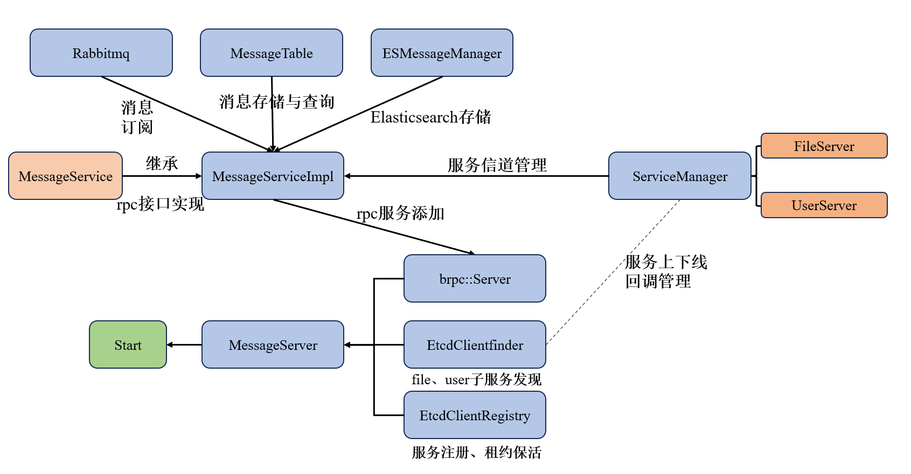
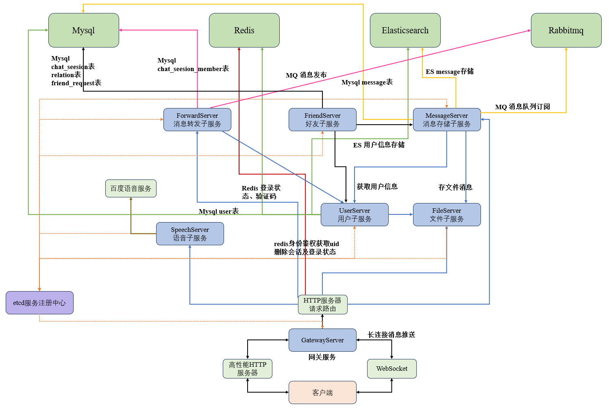

# MicroChat Backend (Server)

本项目是 MicroChat 微服务架构的后端实现，采用 C++ 编写，基于 **brpc**、**Protobuf** 以及多种现代中间件构建。系统支持高并发、组件化部署，具备完善的用户管理、即时通讯、文件存储及语音识别等功能。

## 🏗️ 架构概览

MicroChat 后端采用典型的 **微服务架构**，通过 **Etcd** 实现服务注册与发现，利用 **Gateway** 统一处理客户端连接。

### 核心组件
- **网关服务 (Gateway Server)**:
  - 提供 HTTP 和 WebSocket 双协议支持。
  - 负责用户鉴权（Session/Token）、请求路由以及即时消息推送。
  - 作为系统入口，通过 Etcd 发现后端服务并进行负载均衡。

- **用户服务 (User Server)**:
  - 负责用户注册、登录、信息管理。
  - 集成 **Elasticsearch** 支持高性能用户搜索。
  - 使用 **MySQL (ODB)** 持久化存储用户信息。
  - 使用 **Redis** 存储会话和验证码。

- **好友服务 (Friend Server)**:
  - 管理好友关系、好友申请及其处理。
  - 负责聊天会话（Chat Session）的创建与成员管理。

- **消息服务 (Message Server)**:
  - **消息存储**: 负责历史消息、最近消息的持久化存储。
  - **消息转发 (Forward)**: 利用 **RabbitMQ** 实现异步消息转发，保证消息推送到对应的网关实例。
  - **架构设计**: 如下图所示（以 Message Server 为例展示微服务内部结构）：
    


- **文件服务 (File Server)**:
  - 提供文件上传与下载功能，支持头像及群聊文件存储。

- **语音服务 (Speech Server)**:
  - 集成百度 AI C++ SDK，提供语音转文字（ASR）功能。

**总体架构如下**：


## 🛠️ 技术栈

| 类别 | 技术 |
| :--- | :--- |
| **开发语言** | C++ 17 |
| **RPC 框架** | [brpc](https://github.com/apache/brpc) |
| **序列化** | Protobuf |
| **网络基础** | **自研高性能 HTTP 框架** (基于 Epoll Reactor) |
| **服务发现** | Etcd |
| **数据库** | MySQL 8.0 (使用 ODB ORM) |
| **缓存/会话** | Redis |
| **全文检索** | Elasticsearch |
| **消息队列** | RabbitMQ |
| **容器化** | Docker, Docker Compose |
| **日志** | spdlog |

## 🛠️ 自研 HTTP 框架说明

本项目基于 C++ 实现了一套高性能的 HTTP 框架，作为网关及各微服务的基础网络设施。

- **底层网络库 ([server.hpp](common/server.hpp))**:
  - 基于 **Epoll Reactor** 模型，通过多线程 EventLoop 实现高并发处理。
  - 封装了高效的 **Buffer** 管理机制、**TimerQueue** 定时任务及 **TCP Server** 基础组件。

- **HTTP 协议层 ([http.hpp](common/http.hpp))**:
  - 支持 **正则路由** 分发机制（GET/POST/PUT/DELETE）。
  - 提供 `Request` / `Response` 类封装，自动化 Header 解析及正文处理。
  - 支持 `Keep-Alive` 长连接，适配现代浏览器及微服务间通信需求。

## 📁 目录结构

```text
server/
├── common/             # 通用封装库（自研 HTTP, MySQL, Redis, Etcd, RabbitMQ, ES 等）
├── proto/              # Protobuf 定义文件
├── gateway/            # 网关微服务
├── user/               # 用户微服务 
├── friend/             # 好友/会话微服务
├── message/            # 消息存储与检索服务
├── forward/            # 消息转发服务
├── file/               # 文件上传下载服务
├── Image/              # 项目架构图及相关资源
├── speech/             # 语音识别服务
├── conf/               # 各服务配置文件 (.conf)
├── sql/                # 数据库初始化脚本 (.sql)
├── data/               # 持久化数据挂载点
├── depends.sh          # 自动提取二进制依赖脚本
├── entrypoint.sh       # 容器启动健康检查脚本
└── docker-compose.yml  # 一键部署配置
```

## 🚀 部署说明

### 1. 环境准备
确保已安装：
- Docker & Docker Compose
- C++ 编译环境 (GCC/Clang, CMake)

### 2. 编译项目
在 `server` 目录下执行：
```bash
mkdir build && cd build
cmake ..
make -j$(nproc)
```

### 3. 提取依赖
系统容器化部署需要各服务的动态库支持，执行脚本自动收集：
```bash
bash depends.sh
```

### 4. 启动服务 (Docker Compose)
在 `server` 目录下执行：
```bash
docker compose up -d
```
该命令将按顺序启动基础设施（Etcd, MySQL, Redis, ES, RabbitMQ）及所有微服务实例。

## 📝 开发注意事项
- **Proto 更新**: 修改 `proto/` 下的文件后，需重新生成源文件并重新编译受影响的服务。
- **配置文件**: 修改 `conf/` 下的配置需要重启对应容器使之生效。
- **数据持久化**: 所有的数据库、ES 索引及日志文件均挂载在 `data/` 目录下，部署前请确保该目录权限正确。
